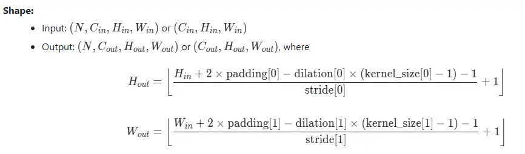
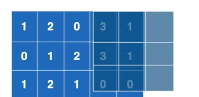

#### 1. 熟悉Linux,c++,YOLO,OpenCV做什么项目
1. RTSP、RTMP，H.264是什么，跟上面的相结合
2. 人脸识别自动开机组件
3. 实践中会发现，问题一般是工程型的问题，是应用场景的，而不是简单的调用OpenCV和YOLO的。重点是用他们解决了什么问题，解决的怎么样，这才有价值。

#### 2.OpenCV入门语法
1. 基本语法
	1. 存储颜色顺序是==[B,G,R]==
```python
import cv2
1. cv2.imread
2. cv2.imshow("image", image)
3. cv2.waitKey()
```

2. 颜色变化
	1. 大多数图像处理是基于灰度图处理的
```python
1. cv2.imshow("blue", image[:, :, 0/1/2]) #末位对应B/G/R
2. gray = cv2.cvtColor(image, cv2.COLOR_BGR2GRAY) #亮度加权平均
```

3. 图像裁剪
```python
crop = image[10:170, 40:200] #先y轴裁剪，再x轴 
```

4. 图像绘制
```python
import numpy as np
# 创建黑色画布
image = np.zeros([300, 300, 3], dtype=np.uint8) #每个元素用什么值存储
# 绘制线段（对象， 起点， 终点， 颜色， 粗细）
cv2.line(image, (100, 200), (250, 250), (255, 0, 0), 2)
# 绘制矩形（~，起点， 对角点， 颜色， 粗细）
cv2.rectangle(image, (30, 100), (60, 150), (0, 255, 0), 2)
# 绘制圆形（~，圆心， 半径， 颜色， 粗细）
cv2.circle(image, (150, 100), 20, (0, 0, 255), 3)
# 绘制字符串（~， 内容， 坐标， 字体格式序号， 缩放系数， 颜色， 粗细， 线条类型序号）
cv2.putText(image, "hello", (100, 50), 0, 1, (255, 255, 255), 2, 1)
```

5. 滤波（Blur）→噪点图去噪
	1. 要质量和边缘特征用高斯
	2. 要速度或是随机噪声用中值
	3. 还有其他滤波器
```python
# 使用高斯滤波器
gauss = cv2.GaussianBlur(image, (5, 5), 0)
# 使用中值滤波器
median = cv2.medianBlur(image, 5)
```

6. 特征提取
	1. 图片先灰度化
	2. 特征点：容易被识别、定位，不易因旋转、缩放、亮度变化而消失的点
	3. `ravel()`: 多维数组展开成为一维数组
```python
# 获取特征点 （对象， 最多的点数， 质量优度水平， 特征点之间的最小距离）
corners = cv2.goodFeaturesToTrack(gray, 500, 0.1, 10)
# 标记出每个点
for corner in corners:
    x, y = corner.ravel()
    cv2.circle(image, (int(x), int(y)), 3, (255, 0, 255), -1)
```

7. 特征匹配
	1. 转灰度
	2. 选取匹配模版（裁剪）
	3. `np.where`返回（y坐标数组，x坐标数组）
	4. `[: : -1]`表示倒序 → `[start,stop,step]`
	5. `*` 表示拆包，相当于把`location[]` 拆成两个`np.array`
	6. `zip()`组合相同位置的元素
	7. 如果想匹配不同大小的图形，可以放大缩小图像匹配多次
```python
# 使用标准相关匹配算法——将待检测对象和模板都标准化再来计算匹配度
match = cv2.matchTemplate(gray, template, cv2.TM_CCOEFF_NORMED)
locations = np.where(match >= 0.9)  # 找出匹配系数大于0.9的匹配点
h, w = template.shape[0:2] #行数对应高度，列数对应宽度
for p in zip(*locations[::-1]):  # 循环遍历每一个匹配点并画出矩形框标记
    x1, y1 = p[0], p[1]
    x2, y2 = x1 + w, y1 + h
    cv2.rectangle(image, (x1, y1), (x2, y2), (0, 255, 0), 2)
```

8. 梯度算法（图像明暗变化
	1. 用来检测边缘
```python
gray = cv2.imread("opencv_logo.jpg", cv2.IMREAD_GRAYSCALE)#直接读取灰度图
# 使用拉普拉斯算子（检测边缘——梯度剧烈变化处），类似二阶导
laplacian = cv2.Laplacian(gray, cv2.CV_64F)

# canny边缘检测（定义边缘为梯度区间）
# 梯度大于200 -> 变化足够强烈，确定是边缘
# 梯度小于100 -> 变化较为平缓，确定非边缘
# 梯度介于二者之间 -> 待定，看其是否与已知的边缘像素相邻 → 是的话，就是边缘
canny = cv2.Canny(gray, 100, 200)
```


9. 阈值算法（最重要的概念之一）A.K.A 二值化算法→只有黑白
	1. 保留灰度图
```python
#灰度二值化
gray = cv2.imread("bookpage.jpg", cv2.IMREAD_GRAYSCALE)
ret, binary = cv2.threshold(gray, 10, 255, cv2.THRESH_BINARY)#ret表示阈值，这里为10

#自适应二值化（adaptiveThreshold）
binary_adaptive = cv2.adaptiveThreshold(
    gray, 255, cv2.ADAPTIVE_THRESH_GAUSSIAN_C, cv2.THRESH_BINARY, 115, 1)
    
# 大津算法（基于图片灰度聚类分析，自定义阈值）
ret1, binary_otsu = cv2.threshold(gray, 0, 255, cv2.THRESH_BINARY + cv2.THRESH_OTSU)
```


10. 图像形态学算法（morphology）→ 暂时可以理解为图片的变胖变瘦
	1. 腐蚀
	2. 膨胀
```python
# 在腐蚀和膨胀之前需要先将图片二值化
gray = cv2.imread("opencv_logo.jpg", cv2.IMREAD_GRAYSCALE)
_, binary = cv2.threshold(gray, 200, 255, cv2.THRESH_BINARY_INV)  # 使用反向阈值——背景白色，图案黑色

kernel = np.ones((5, 5), np.uint8)  # 操作需要用到的kernel

# 腐蚀和膨胀操作
erosion = cv2.erode(binary, kernel)
dilation = cv2.dilate(binary, kernel)

cv2.imshow("binary", binary)
cv2.imshow("erosion", erosion)
cv2.imshow("dilation", dilation)
```

11. 调用摄像头
```python
# 获取摄像头设备的指针(设备管理器 -> 照相机)
capture = cv2.VideoCapture(0)
ret = True

# 摄像头的读取是连续不断的，需要循环读取
while ret:
    ret, frame = capture.read()
    '''
    ret：这是一个布尔值，表示读取操作是否成功。
    如果 ret 为 True，表示成功读取了一帧图像；如果为 False，则表示读取失败，可能是因为视频流结束或者其他错误。
    在处理视频流时，这个返回值通常用于控制循环，直到视频流结束。

    frame：这是一个NumPy数组，代表了从视频捕获对象读取的当前帧。
    这个数组通常是一个三维的，其形状为 (高度, 宽度, 通道数)，其中通道数可以是1（灰度图像）或3（彩色图像，分别对应红、绿、蓝通道）。
    '''
    cv2.imshow("camera", frame)
    key = cv2.waitKey(1)  # 等待键盘输入1ms
    if key != -1:  # 按任意键跳出循环
        break

capture.release()  # 释放指针
```
#### 3.计算机如何学会立即识别物体
1. 之前的图像识别：切分成多个区域，执行多次神经网络识别
2. 提出YOLO
	1. 网络二值化：把权重或激活值压缩到1或者-1，减少计算量和存储空间
	2. 近似量化：把浮点数用较低精度整数表示

#### 4. Pytorch 入门
##### 4.1 Pytorch加载数据
1. Dataset：为网络提供不同的数据形式
	1. 如何获取 & 总共有多少数据（确定要多少次
	2. 本身是一个抽象类
		1. overwrite `__getitem__`,用于获取label 
		2. overwrite `__len__` 获取长度
2. Dataloader：提供一种方式去获取数据及其label (加载器)，从dataset里面取数据
3. ==进虚拟环境==：`& .\.venv\Scripts\Activate.ps1`
4. 仿造数据集的时候，可能需要把真实和开源的数据集混在一起，可以用 `train_dataset = a_dataset + b_dataset`
5. `shuffle(boolean)` : 一般设为true，确保打乱
6. `num_workers` : 有多少个子进程，如果为0，就是在用主进程跑
7. `drop_last`: 抛弃余数
8. 可以通过ctrl+左键, 看一些函数究竟会返回什么变量, 然后去写对应的变量名.
9. 如何在终端启用tensorboard
```bash
#STEP1: 启动pytorch环境
#step2:
tensorboard --logdir=地址名
```

---
##### 4.2.神经网络核心部分
1. nn.Module: base class for all nn modules. 一般来说就是继承这个class, 然后做改动.
```python
import torch.nn as nn
import torch.nn.functional as F

class Model(nn.Module):
	def __init__(self):
		#先执行父类的init
		super(Model,self).__init__()
		self.conv1 = nn.Conv2d(1,20,5)
		self.conv2 = nn.Conv2d(20,20,5)
	
	#定义了一个计算,应该在每个子代中重写	
	def forward(self,x):
		x= F.relu(self.conv1(x))
		return F.relu(self.conv1(x))
```
2. pytorch 打印多余的浮点数 (e.g. 0)时, 会省略掉. 比如`1.0` output就是 `1.`

3. 相关的docs
	1. torch.nn: 封装好, 可直接运行 → 掌握
	2. torch.nn.functional: 学习每个部件怎么运行

4. conv2d: 主要设置in_channels , out_channels (数量对应==卷积核的数量==) , kernel_size (相关值会在训练过程中不断调整) , stride, padding 五个参数
	1. **weight**：卷积核
	2. **stride**：步长，可以是单个数，也可以是元组 $(s_H, s_W)$
	3. **reshape** 函数：`a = torch.reshape(input, (w, x, y, z))`
	4. padding: 决定填充的大小, 输入可以是单数或者是 tuple $(padH, padW)$, 默认为0
	5. dilation:  膨胀, 卷积核当中两个元素, 在图像上的差值, AKA 空洞卷积
	6. 输出尺寸公式：
	


5. Pooling: 最大池化 (减少运算量, 保留想要的特征), 也被称为下采样(除pooling外还有其他实现方法) -> nn.MaxPool2d
	1. 作用:
		- 减少计算量和内存占用
		- 扩大后续神经元的感受范围
		- 保留较明显的特征，例如边缘、纹理
		- 对物体位置的小幅移动不那么敏感
	2. 默认stride = kernel_size (区别于conv2d的"1") -> 针对池化核
	3. ceil_mode: floor向下取整, ceil是向上取整
		e.g. 是否保留这个六个元素处理的结果
		


6. 非线性激活 (接在卷积层和池化层后, 用于提升模型的泛化能力)
	1. ReLU
		1. `ReLU (input, inplace = True)`, 这里的inplace就是决定是否对原来的那个值直接进行变换. 一般采用 default, 即false.
	2. Sigmoid

7. 正则化 -> 加快NN的训练速度
