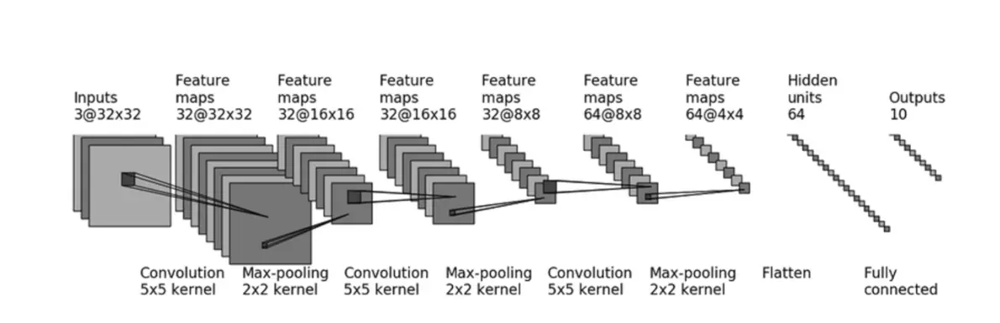
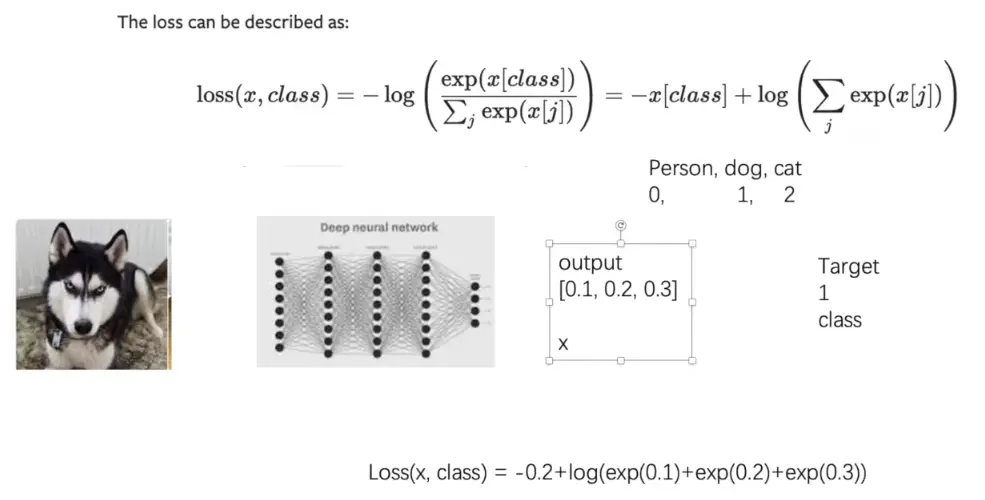
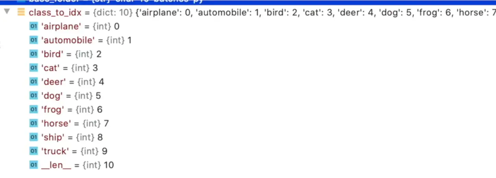

#### 1. 熟悉Linux,c++,YOLO,OpenCV做什么项目
1. RTSP、RTMP，H.264是什么，跟上面的相结合
2. 人脸识别自动开机组件
3. 实践中会发现，问题一般是工程型的问题，是应用场景的，而不是简单的调用OpenCV和YOLO的。重点是用他们解决了什么问题，解决的怎么样，这才有价值。

#### 2. 通识部分
1. ==ultralytics== : 高度封装好的YOLO库 (github上有个super-vision, 也集成了yolo)
2. 目标检测主流模型
	1. 目标检测
		│
		├── CNN / 实时检测路线
		│     ├── YOLOv5（2020）
		│     ├── YOLOv8（2023）
		│     ├── YOLO11（2024）
		│     └── 各类工业定制 YOLO（2020—至今）
		│
		├── Transformer / DETR 路线
		│     ├── DETR（2020）
		│     ├── Deformable DETR（2020）
		│     ├── DINO（2022，ICLR 2023）
		│     └── RT-DETR（2023）
		│
		└── 视觉语言 / 开放词汇路线
		      ├── Grounding DINO（2023，ECCV 2024）
		      ├── YOLO-World（2024，CVPR 2024）
		      └── YOLOE（2025，ICCV 2025）
3. **Softmax：把分数变概率。**  
4. **Argmax：从概率或分数里选最大类别。**
5. **Tensor:** 
	1. scalar 属于0维张量
	2. 一个二维数组 = 二维张量 (重命名这一块)
	3. 用GPUs加速 or TPUs (专为tensor)
	4. 自动计算反向传播 => Pytorch有自动求导机制 (`loss.backward()`)
#### 3.OpenCV入门语法
1. 基本语法
	1. 存储颜色顺序是==[B,G,R]==
```python
import cv2
1. cv2.imread
2. cv2.imshow("image", image)
3. cv2.waitKey()
```

2. 颜色变化
	1. 大多数图像处理是基于灰度图处理的
```python
1. cv2.imshow("blue", image[:, :, 0/1/2]) #末位对应B/G/R
2. gray = cv2.cvtColor(image, cv2.COLOR_BGR2GRAY) #亮度加权平均
```

3. 图像裁剪
```python
crop = image[10:170, 40:200] #先y轴裁剪，再x轴 
```

4. 图像绘制
```python
import numpy as np
# 创建黑色画布
image = np.zeros([300, 300, 3], dtype=np.uint8) #每个元素用什么值存储
# 绘制线段（对象， 起点， 终点， 颜色， 粗细）
cv2.line(image, (100, 200), (250, 250), (255, 0, 0), 2)
# 绘制矩形（~，起点， 对角点， 颜色， 粗细）
cv2.rectangle(image, (30, 100), (60, 150), (0, 255, 0), 2)
# 绘制圆形（~，圆心， 半径， 颜色， 粗细）
cv2.circle(image, (150, 100), 20, (0, 0, 255), 3)
# 绘制字符串（~， 内容， 坐标， 字体格式序号， 缩放系数， 颜色， 粗细， 线条类型序号）
cv2.putText(image, "hello", (100, 50), 0, 1, (255, 255, 255), 2, 1)
```

5. 滤波（Blur）→噪点图去噪
	1. 要质量和边缘特征用高斯
	2. 要速度或是随机噪声用中值
	3. 还有其他滤波器
```python
# 使用高斯滤波器
gauss = cv2.GaussianBlur(image, (5, 5), 0)
# 使用中值滤波器
median = cv2.medianBlur(image, 5)
```

6. 特征提取
	1. 图片先灰度化
	2. 特征点：容易被识别、定位，不易因旋转、缩放、亮度变化而消失的点
	3. `ravel()`: 多维数组展开成为一维数组
```python
# 获取特征点 （对象， 最多的点数， 质量优度水平， 特征点之间的最小距离）
corners = cv2.goodFeaturesToTrack(gray, 500, 0.1, 10)
# 标记出每个点
for corner in corners:
    x, y = corner.ravel()
    cv2.circle(image, (int(x), int(y)), 3, (255, 0, 255), -1)
```

7. 特征匹配
	1. 转灰度
	2. 选取匹配模版（裁剪）
	3. `np.where`返回（y坐标数组，x坐标数组）
	4. `[: : -1]`表示倒序 → `[start,stop,step]`
	5. `*` 表示拆包，相当于把`location[]` 拆成两个`np.array`
	6. `zip()`组合相同位置的元素
	7. 如果想匹配不同大小的图形，可以放大缩小图像匹配多次
```python
# 使用标准相关匹配算法——将待检测对象和模板都标准化再来计算匹配度
match = cv2.matchTemplate(gray, template, cv2.TM_CCOEFF_NORMED)
locations = np.where(match >= 0.9)  # 找出匹配系数大于0.9的匹配点
h, w = template.shape[0:2] #行数对应高度，列数对应宽度
for p in zip(*locations[::-1]):  # 循环遍历每一个匹配点并画出矩形框标记
    x1, y1 = p[0], p[1]
    x2, y2 = x1 + w, y1 + h
    cv2.rectangle(image, (x1, y1), (x2, y2), (0, 255, 0), 2)
```

8. 梯度算法（图像明暗变化
	1. 用来检测边缘
```python
gray = cv2.imread("opencv_logo.jpg", cv2.IMREAD_GRAYSCALE)#直接读取灰度图
# 使用拉普拉斯算子（检测边缘——梯度剧烈变化处），类似二阶导
laplacian = cv2.Laplacian(gray, cv2.CV_64F)

# canny边缘检测（定义边缘为梯度区间）
# 梯度大于200 -> 变化足够强烈，确定是边缘
# 梯度小于100 -> 变化较为平缓，确定非边缘
# 梯度介于二者之间 -> 待定，看其是否与已知的边缘像素相邻 → 是的话，就是边缘
canny = cv2.Canny(gray, 100, 200)
```


9. 阈值算法（最重要的概念之一）A.K.A 二值化算法→只有黑白
	1. 保留灰度图
```python
#灰度二值化
gray = cv2.imread("bookpage.jpg", cv2.IMREAD_GRAYSCALE)
ret, binary = cv2.threshold(gray, 10, 255, cv2.THRESH_BINARY)#ret表示阈值，这里为10

#自适应二值化（adaptiveThreshold）
binary_adaptive = cv2.adaptiveThreshold(
    gray, 255, cv2.ADAPTIVE_THRESH_GAUSSIAN_C, cv2.THRESH_BINARY, 115, 1)
    
# 大津算法（基于图片灰度聚类分析，自定义阈值）
ret1, binary_otsu = cv2.threshold(gray, 0, 255, cv2.THRESH_BINARY + cv2.THRESH_OTSU)
```


10. 图像形态学算法（morphology）→ 暂时可以理解为图片的变胖变瘦
	1. 腐蚀
	2. 膨胀
```python
# 在腐蚀和膨胀之前需要先将图片二值化
gray = cv2.imread("opencv_logo.jpg", cv2.IMREAD_GRAYSCALE)
_, binary = cv2.threshold(gray, 200, 255, cv2.THRESH_BINARY_INV)  # 反向阈值后，原本亮的区域变黑，原本暗的区域变白

kernel = np.ones((5, 5), np.uint8)  # 操作需要用到的kernel

# 腐蚀和膨胀操作
erosion = cv2.erode(binary, kernel)
dilation = cv2.dilate(binary, kernel)

cv2.imshow("binary", binary)
cv2.imshow("erosion", erosion)
cv2.imshow("dilation", dilation)
```

11. 调用摄像头
```python
# 获取摄像头设备的指针(设备管理器 -> 照相机)
capture = cv2.VideoCapture(0)
ret = True

# 摄像头的读取是连续不断的，需要循环读取
while ret:
    ret, frame = capture.read()
    '''
    ret：这是一个布尔值，表示读取操作是否成功。
    如果 ret 为 True，表示成功读取了一帧图像；如果为 False，则表示读取失败，可能是因为视频流结束或者其他错误。
    在处理视频流时，这个返回值通常用于控制循环，直到视频流结束。

    frame：这是一个NumPy数组，代表了从视频捕获对象读取的当前帧。
    这个数组通常是一个三维的，其形状为 (高度, 宽度, 通道数)，其中通道数可以是1（灰度图像）或3（彩色图像，分别对应红、绿、蓝通道）。
    '''
    cv2.imshow("camera", frame)
    key = cv2.waitKey(1)  # 等待键盘输入1ms
    if key != -1:  # 按任意键跳出循环
        break

capture.release()  # 释放指针
```
#### 4.计算机如何学会立即识别物体
1. 之前的图像识别：切分成多个区域，执行多次神经网络识别
2. YOLO核心是单阶段目标检测；二值化/量化是模型压缩加速技术，不是YOLO本身

#### 5. PyTorch 入门
##### 5.1 PyTorch加载数据
1. Dataset：为网络提供不同的数据形式
	1. 如何获取 & 总共有多少数据（确定要多少次
	2. 本身是一个抽象类
		1. overwrite `__getitem__`,用于获取一条数据以及其label 
		2. overwrite `__len__` 获取长度
2. Dataloader：提供一种方式去获取数据及其label (加载器)，从dataset里面取数据
```python
#不记得参数了可以用ctrl+shift+space
import torch
dataset = torchvision.datasets.CIFAR10("../data", train = False, transform = torchvision.transforms.ToTensor(),
download = True)

dataloader = Dataloader(dataset, batch_size = 64)

for data in dataloader:
	imgs, targets = data
	print(imgs.shape)
```

3. ==进虚拟环境==：`& .\.venv\Scripts\Activate.ps1`
4. 仿造数据集的时候，可能需要把真实和开源的数据集混在一起，可以用 `train_dataset = a_dataset + b_dataset`
5. `shuffle(boolean)` : 一般设为true，确保打乱
6. `num_workers` : 有多少个子进程，如果为0，就是在用主进程跑
7. `drop_last`: 抛弃余数
8. 可以通过ctrl+左键, 看一些函数究竟会返回什么变量, 然后去写对应的变量名.
9. 如果要求是浮点数, 可以在赋值后面加上`dtype`来限制
   ```python
   import torch
   inputs = torch.tensor([1,2,3], dtype = torch.float32)
   ```
10. 如何在终端启用tensorboard
```bash
#STEP1: 启动pytorch环境
#step2:
tensorboard --logdir=地址名
```

---
##### 5.2.神经网络核心部分
1. nn.Module: base class for all nn modules. 一般来说就是继承这个class, 然后做改动.
```python
import torch.nn as nn
import torch.nn.functional as F

class Model(nn.Module):
	def __init__(self):
		#先执行父类的init
		super(Model,self).__init__()
		self.conv1 = nn.Conv2d(1,20,5)
		self.conv2 = nn.Conv2d(20,20,5)
	
	#定义了一个计算,应该在每个子代中重写	
	def forward(self,x):
		x= F.relu(self.conv1(x)); return x
```
2. pytorch 打印多余的浮点数 (e.g. 0)时, 会省略掉. 比如`1.0` output就是 `1.`

3. 相关的docs
	1. torch.nn: 封装好, 可直接运行 → 掌握
	2. torch.nn.functional: 学习每个部件怎么运行

4. conv2d: 主要设置in_channels , out_channels (数量对应==卷积核的数量==) , kernel_size (本身固定；卷积核里的 weight 会训练更新) , stride, padding 五个参数
	1. **weight**：卷积核
	2. **stride**：步长，可以是单个数，也可以是元组 $(s_H, s_W)$
	3. ==**reshape** 函数==：`a = torch.reshape(input, (batch_size, channel, height, width))`
	4. padding: 决定填充的大小, 输入可以是单数或者是 tuple $(padH, padW)$, 默认为0
	5. dilation:  膨胀, 卷积核当中两个元素, 在图像上的差值, AKA 空洞卷积
	6. 输出尺寸公式：
	


5. Pooling: 最大池化 (减少运算量, 保留想要的特征), 也被称为下采样(除pooling外还有其他实现方法) -> nn.MaxPool2d
	1. 作用:
		- 减少计算量和内存占用
		- 扩大后续神经元的感受范围
		- 保留较明显的特征，例如边缘、纹理
		- 对物体位置的小幅移动不那么敏感
	2. 默认stride = kernel_size (区别于conv2d的"1") -> 针对池化核
	3. ceil_mode: floor向下取整, ceil是向上取整
		e.g. 是否保留这个六个元素处理的结果：


6. 非线性激活 (接在卷积层和池化层后, 用于提升模型的泛化能力)
	1. ReLU
		1. `ReLU (input, inplace = True)`, 这里的inplace就是决定是否对原来的那个值直接进行变换. 一般采用 default, 即false.
		2. 取值范围 $ReLU(x) = max (0,x)$
		3. 通常接在 Conv/Linear 后，用于引入非线性、提升表达能力
	2. Sigmoid

7. 多种不同的函数包
	1. BatchNorm2d 是归一化层，主要稳定/加快训练；Dropout/weight decay 更典型地叫正则化
	  注: ==7.2-7.4==层是用于特定的网络结构
	2. Recurrent 层(文字识别), 特定的网络结构
	3. Transformer Layer
	4. Sparse Layer
	5. Dropout Layers (用于防止过拟合)
	6. Linear Layers
		1. weight和bias都是从一定分布中取的采样.
		2. 参数是`Linear(in_features, out_features, bias)`
		3. `torch.flatten(t)`: 展平参数 -> 不需要`torch.reshape`了
	7. Embedding Layer (用于NLP)

	8. `torchvision.models`这个包里有很多成型的模型, ==可以直接调用==, 语音也有balabala
	9. sequential (按顺序执行代码, 方便管理)
		1. CIFAR10 model的网络结构  对应nn_seq.py
			
		2. 按这个结构, 算好padding后, 开始写代码
		3. 用处: 在写`forward()`时会方便很多
		 ```python
				 from torch import nn
				 Class a(nn.module):
					 def __init__(self):
						 super(a, self).__init__()
							 self.model1 = Sequential(
								 .....
								 .....
							 )
					
					def forward(self,x):
						x = self.model1(x)
						return x
				A = a()
				print(A)
		 ```
##### 5.3 训练部分
1. loss  function:
	1. 计算实际和目标的差距
	2. 为更新模型参数提供依据 (反向传播)
	3. L1loss: 有Mean 和 Sum两种计算方式, 详细见官方文档
	4. cross Entropy
		
	5. loss function 使用方法:
		```python
		loss = nn.CrossEntropyLoss()
		
		#print dataloader
		balabalabalabala
		result_loss = loss(outputs, targets)
		
		#用backward做反向传播, 计算grad, 后续配合优化器来降低loss
		result_loss.backward()
		```

2. 优化器: `torch.optim`
	1.  入门时重点关注函数的parameter和lr (Learning rate) 输入 
	2. 代码示例：
	
		```python
		tudui = Tudui()
		#设置参数
		optim = torch.optim.SGD(tudui.parameters(), lr=0.01)
		
		for epoch in range(20):
		    running_loss = 0.0
		    for data in dataloader:
		        imgs, targets = data
		        outputs = tudui(imgs)
		        result_loss = loss(outputs, targets)
		        # 每次更新后清空上一轮梯度
		        optim.zero_grad()
		        result_loss.backward()
		        #更新
		        optim.step()
		        running_loss += result_loss.item()
		    print(running_loss)
		```


3. 现有网络模型的使用和修改
	1. 有两个可以关注的para:
		1. `weights`, if true => 训练好的模型 (已不适用)
			1. 如果是false, 只是加载模型, 参数随机
			2. true的话, 需要下载一些参数 
		2. `progress`, if true => 进度条
		3. 用VGG16来提取一些特征, 然后结合其他的网络模型来应用 
		4. 
			```python
			from torchvision.models import vgg16, VGG16_Weights
			vgg16_false = vgg16(weights=None)
			vgg16_true = vgg16(weights=VGG16_Weights.DEFAULT)
			```
			
			
4. 网络模型的保存与读取
	1. 方法一
		1. `torch.save(vgg16, "vgg16_method1.pth` : 保存了网络模型的结构和参数
		2. `model = torch.load("vgg16_method1.pth) `
	2. 方法二
		1. 通过字典, 保存模型参数（官方推荐 = > 省内存）`torch.save(vgg16.state_dict(), "vgg16_method2.pth")`
		2.  `vgg16.load_state_dict()
	3. 如果是自定义, 就要把类定义和load放在一个文件里, 或者用`from file_name import *`

5. 完整的模型训练套路 (主要看准备, model, train)
	1. 准备数据集(train & test)
	2. 用dataloader来加载数据集
		1. 可以用`len()` 和 `print("xxx:{}".format(xxx))`来求数据集size
	3. model搭建要单独放在一个model.py会好点, 然后import进来
		1. 记得要补充一个`if __name__ == '__main__ :'
			```python
			if __name__ == '__main__':
			    tudui = Tudui()
			    # torch.ones(): 创造一个全是1的张量
			    input = torch.ones((64, 3, 32, 32))
			    output = tudui(input)
			    print(output.shape)
			```
	4. 创建网络模型 `a = A()`
	5. 损失函数
	6. 优化器 (把Learning rate 单独提出来作为一个变量, 方便修改)
		1. 0.01 = 1e-2, 这里的e表示10
		2. 
	7. 设置网络训练的参数 
		1. 记录训练的次数
		2. 记录测试的次数
		3. 记录训练的epoch
	
	8. 测试代码 
		1. `torch.no_grad()` : 不记录计算图、不计算梯度，省显存
		2. 结合tensorboard来看曲线
		3. `torch.save()`
	9. 注意`train()` 和`eval()` 两个函数的使用场景, 比如说网络模型涵盖了`Dropout` 和 `BatchNorm`层等的时候

6. 完整流程示例
```python
import torchvision
from torch.utils.tensorboard import SummaryWriter
from model import *

# 准备数据集
from torch import nn
from torch.utils.data import DataLoader

train_data = torchvision.datasets.CIFAR10(root="../data", train=True, transform=torchvision.transforms.ToTensor(),

                                          download=True)

test_data = torchvision.datasets.CIFAR10(root="../data", train=False, transform=torchvision.transforms.ToTensor(),

                                         download=True)

# length 长度
train_data_size = len(train_data)
test_data_size = len(test_data)

# 如果train_data_size=10, 训练数据集的长度为：10
print("训练数据集的长度为：{}".format(train_data_size))
print("测试数据集的长度为：{}".format(test_data_size))

# 利用 DataLoader 来加载数据集
train_dataloader = DataLoader(train_data, batch_size=64)
test_dataloader = DataLoader(test_data, batch_size=64)

# 创建网络模型
tudui = Tudui()

# 损失函数
loss_fn = nn.CrossEntropyLoss()

# 优化器
# learning_rate = 0.01
# 1e-2=1 x (10)^(-2) = 1 /100 = 0.01
learning_rate = 1e-2
optimizer = torch.optim.SGD(tudui.parameters(), lr=learning_rate)

# 设置训练网络的一些参数
# 记录训练的次数
total_train_step = 0
# 记录测试的次数
total_test_step = 0
# 训练的轮数
epoch = 10

# 添加tensorboard
writer = SummaryWriter("../logs_train")

for i in range(epoch):
    print("-------第 {} 轮训练开始-------".format(i+1))
    # 训练步骤开始
    tudui.train()
    for data in train_dataloader:
        imgs, targets = data
        outputs = tudui(imgs)
        loss = loss_fn(outputs, targets)
        # 优化器优化模型
        optimizer.zero_grad()
        loss.backward()
        optimizer.step()
        total_train_step = total_train_step + 1
        if total_train_step % 100 == 0:
            #loss.item() 相较于 loss, 是更正规的写法
            print("训练次数：{}, Loss: {}".format(total_train_step, loss.item()))
            writer.add_scalar("train_loss", loss.item(), total_train_step)

    # 测试步骤开始
    tudui.eval()
    total_test_loss = 0
    total_accuracy = 0
    with torch.no_grad():
        for data in test_dataloader:
            imgs, targets = data
            outputs = tudui(imgs)
            loss = loss_fn(outputs, targets)
            total_test_loss = total_test_loss + loss.item()
            accuracy = (outputs.argmax(1) == targets).sum()
            total_accuracy = total_accuracy + accuracy

    print("整体测试集上的Loss: {}".format(total_test_loss))
    print("整体测试集上的正确率: {}".format(total_accuracy/test_data_size))
    writer.add_scalar("test_loss", total_test_loss, total_test_step)
    writer.add_scalar("test_accuracy", total_accuracy/test_data_size, total_test_step)
    total_test_step = total_test_step + 1

    torch.save(tudui, "tudui_{}.pth".format(i))
    print("模型已保存")

writer.close()
```

7. 使用GPU来训练
	1. 方法一
		1. 找到网络模型; 数据(输入,标注); 损失函数; => `.cuda()`即可 
		2. 数据标注是在`imgs, targets = data`这一步, 初始化和训练的里面都需哟
		3. 最好在前面有 `if torch.cuda.is_available(): `
	2. 方法二(`.to(device)`) ==主要方法==
		1. 其余详见`train_gpu_2.py`
		2. 区别于`cuda()`, 这里除了数据以外, 其他两项不需要额外重新赋值变量
	3. Colaboratory
		1. 修改 -> 笔记本设置 -> 换成cpu/tpu来跑
8. 模型验证套路
	1. CIFAR10 数据集类别
	2. 
	3. 用gpu训练时, 有可能遇到需要`map_location=torch.device('cpu')`的情况, 在load model那一块
