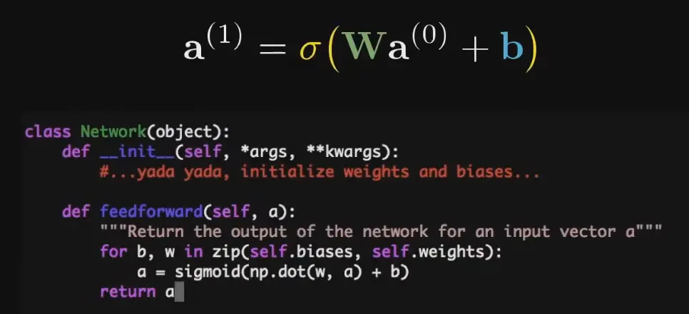

#### 1.神经网络结构
1. 最经典的原版: multilayer perception 多层感知器
2. 每一个像素都是灰度图, range in [0,1], 叫做activation, 0黑1白
3. 在识别数字中, 我们希望倒数第二层的各个神经元能各自对应一个笔画部件. 
4. 因为激活值在[0,1]之间, 所以需要引入正则化函数, 比如sigmoid函数:
$$
\sigma(x)=\frac{1}{1+e^{-x}}
$$

5. treat neuron as a function
	1. 每一个neuron的输入是上一层的输出
	2. 输出一个[0,1]的值 
